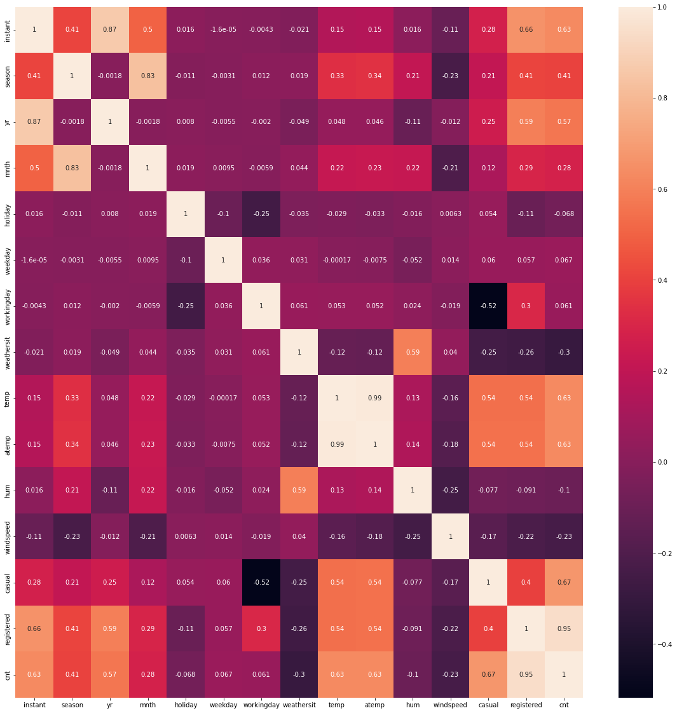

# Bike Sharing Regression

This is a regression project using Python and a data set containing information about bicycle rentals, weather conditions and holiday dates. Our goal was to use this data set to compare different regression algorithms and find which one performs best at predicting how many bicycles will be rented in a given day, taking into account time of the year, day of the week, temperature, among other features. The algorithms we tested were linear regression, polynomial linear regression, decision tree regression, random forest regression, support vector regression and neural network regression.

##  1. Introduction

Bike sharing systems allow users to rent a bike in one location and return it in another. Since these systems keep track of how many bikes were rented in a given period, for how long they were in use and where they were rented and returned, they prove a valuable source o data for machine learning and, in return, can greatly benefit from using machine learning to inform their business decisions. The data set contains information about the rental of bikes in Washington, D. C. for each day, as well as about the weather and if that day was a holiday. The idea behind this project was to use different regression algorithms to predict how many rentals there will be in a given day and to determine which of the regressors is best suited for this problem.

The data set we will be using is the *day.csv* file (renamed to *bike_sharing_day.csv*), downloaded from https://archive.ics.uci.edu/ml/datasets/Bike+Sharing+Dataset. This data was used for event labeling in [Fanaee-T, Hadi, and Gama, Joao, 'Event labeling combining ensemble detectors and background knowledge', Progress in Artificial Intelligence (2013): pp. 1-15, Springer Berlin Heidelberg](https://link.springer.com/article/10.1007/s13748-013-0040-3).

## 2. Exploratory Data Analysis

Before we employ our machine learning algorithms, let us explore the data set. It accounts for a period of 731 days (two years, 2011 and 2012), during which and average of 4504.348837 bikes were rented per day.

Calculating the correlations between the columns we see that attributes such as temperature, year and season have the highest correlation with the number of rentals (cnt).

Next, we can plot the number of bikes rented per day, obtaining the graph below. We see that there were more rentals on 2012 than in 2011 and that most of the rentals happened towards the middle of these years.

Since “temperature” had one of the highest correlations with the number of rentals, we may also plot these two in a scatter plot, from which we can see that the highest the average temperature in a given day, the more rentals there are.

Our last step is to create pivot tables to analyze the relation between the relevant discreet variables with the number of rentals. We begin by counting how many rentals there were per year and obtain, as expected, that there were more rentals in the second year. Doing the same for months and seasons, we confirm that there were more rentals towards the middle of the year, while doing it for days of the days of the week we obtain that the number of rentals increases as the week progresses, reaching a maximum on Friday. Finally, we calculate the average number of rentals for each weather situation (the higher the number, the less clear the weather) and obtain, as expected, that the clearer the weather the more rentals there are.

## 3. Preprocessing

Now let us prepare the data for the machine learning algorithms. Our first step is to choose which attributes we will use for the predictions, or rather, which ones we won’t. The discreet attributes "instant" and "dteday" are there for indexing purposes and never repeat themselves, therefore we will not use them. The attributes "temp" and "atemp" are highly correlated with each other, so we need pick only one of the two for the predictions, we choose "temp". Finally, we are not interested in whether the clients were "casual" or "registered", so we drop these two columns.

Since all the attributes are numeric, there is no need to employ the label encoder or the one hot encoder.

Finally, we must use the standard scaler on our data. This is only required for the support vector and neural network regressors but, since we want to have the same starting data for all of the algorithms, we perform standardization now.

## 4. Regression Algorithms

Before we begin applying the regression algorithms, we will illustrate the method we will follow for each regressor.

The first step (when applicable) is the tuning of the parameters, in which we use the grid search function of the scikit-learn package to test for different train-test splits and find the parameters that will lead to the best r2 score. The closest this score is to 1, the closest the predictions were to the real result.

Once we determine the parameters, we use the cross validation to calculate the r2 score and the (negative) mean absolute error, where cross validation means using different train-test splits. We will set k=10, meaning that we are going to split the base in ten parts and alternate which one is used for the test. We will do this with 30 different splits. At the end of this process, we are going to have arrays with 30 different values of r2 score and mean absolute error, which we will use to evaluate how well the algorithm has performed.

### 4.1. Linear Regression

The first algorithm we are going to consider is the linear regressor. This algorithm seeks a linear relation between the attributes and what we want to predict.

This regressor has no relevant parameters, so we skip the tuning step.

We obtain a mean r2 score of 0.786405 and an average mean absolute error of 0.340964

### 4.2. Polynomial Linear Regression

The next algorithm we will study is the polynomial linear regressor, which seeks a polynomial relation between the attributes and what we want to predict. In terms of implementation, this is the same algorithm as the linear regressor, but we apply a polynomial transformation on the data before we use the algorithm.

The only parameter we need to concern ourselves with is the order of the polynomial transformation. Since this is an external parameter to the algorithm, we perform the tuning manually, considering orders of 2, 3 and 4. Out of these, only order 2 gives acceptable results, as orders 3 and 4 seem to lead to overfitting.

We obtain a mean r2 score of 0.837397 and an average mean absolute error of 0.280890.

### 4.3. Decision Tree Regression

Next, we will consider the decision tree regressor. This algorithm creates a tree, with the attributes as the nodes and their values as the branches, where each split in the branches corresponds to a split in the samples. Once all the splits are done, the algorithm calculates the average of the value we want to to predict for the samples in each split region, so that, using the tree, we can predict the desired variable for new samples.

We can then perform the parameter tuning, from which we have that the best value for "criterion" is "absolute error", for "min_samples_leaf" it's 5, for "min_samples_split" it's 2 and for "splitter" it's "best". 

We obtain a mean r2 score of 0.802226 and an average mean absolute error of 0.309419.

### 4.4. Random Forest Regression

We can now test the random forest regressor. This algorithm employs multiple different decision trees at the same time and calculates the average of their results to determine the prediction.

Performing the tuning of the parameters, we have that the best value for "criterion" is "absolute error", for "min_samples_leaf" it's 1, for "min_samples_split" it's 2 and for "n_estimators" it's 150.

We obtain a mean r2 score of 0.878787 and an average mean absolute error of 0.235574.

### 4.5. Support Vector Regression

The next regressor we are going to study is the support vector regression algorithms. This algorithm creates hyperplanes separating the samples and uses these hyperplanes to make predictions on the data.

Tuning the parameters, we have that the best value for "C" is 2, for "kernel" it's "rbf" and for "tol" it's 0.001.

We obtain a mean r2 score of 0.893968 and an average mean absolute error of 0.223523.

### 4.6. Neural Network Regression

The last algorithm we are going to consider is the multi-layer perceptron regressor. This algorithm works based on artificial neural networks, emulating the behavior of neurons.

Tuning the parameters, we have that the best value for "activation" is "logistic", for "batch_size" it's 10 and for "solver" it's "adam".  We use two hidden layers with 6 neurons in each.

We obtain a mean r2 score of 0.867738 and an average mean absolute error of 0.259433.

## 5. Comparing the Algorithms

Looking at the calculated values for the r2 score and the mean absolute error, it is easy to see that the support vector regression algorithm presents the best results. However, before we conclude that it is the best regressor for this problem, we must verify if the results are statistically distinct from each other.

The way we are going to do this is with the ANOVA and Tukey tests, which compare normally distributed data, meaning that our first step is to check if the results are normally distributed (null hypothesis) or not (alternative hypothesis), we do this with the Shapiro test.

Employing this test, we obtain that most of the results are normally distributed (p-value smaller than 0.05), and even the ones that aren’t are still close to a normal distribution, as can be seen from the plotted graphs.

We then proceed with the ANOVA test, which will compare all of the results and tell us if they are statistically the same (null hypothesis) or statistically distinct (alternative hypothesis). Since the p-value is smaller than 0.05, we reject the null hypothesis and accept the alternative hypothesis.

Finally, we use the Tukey test to compare each set of results with each other one and determine if they are statistically distinct. We obtain that the results are all statistically distinct from each other. Therefore, we can conclude that the support vector regression algorithm is indeed the best choice for this problem

## 6. Conclusion

We used a data set containing information about bike rentals in Washington D. C., weather condition and holidays to compare the performance of different regression algorithms at predicting the number of rentals in a given day.

An initial analysis on the data revealed that there were more rentals on 2012 than in 2011 and that most of the rentals happened towards the middle of these years. We also analyzed the correlation coefficients of the attributes and obtained that, out of the ones that were of interest to us, the ones with the highest correlations were year, season and temperature.

Once the data was in a suitable form, we employed the algorithms of linear regression, polynomial linear regression, decision tree regression, random forest regression, support vector regression and multi-layer perceptron regression and calculated the r2 score and the mean absolute error. We obtained that the results were all statistically distinct from each other and that the algorithm with the best performance was the support vector regression.
